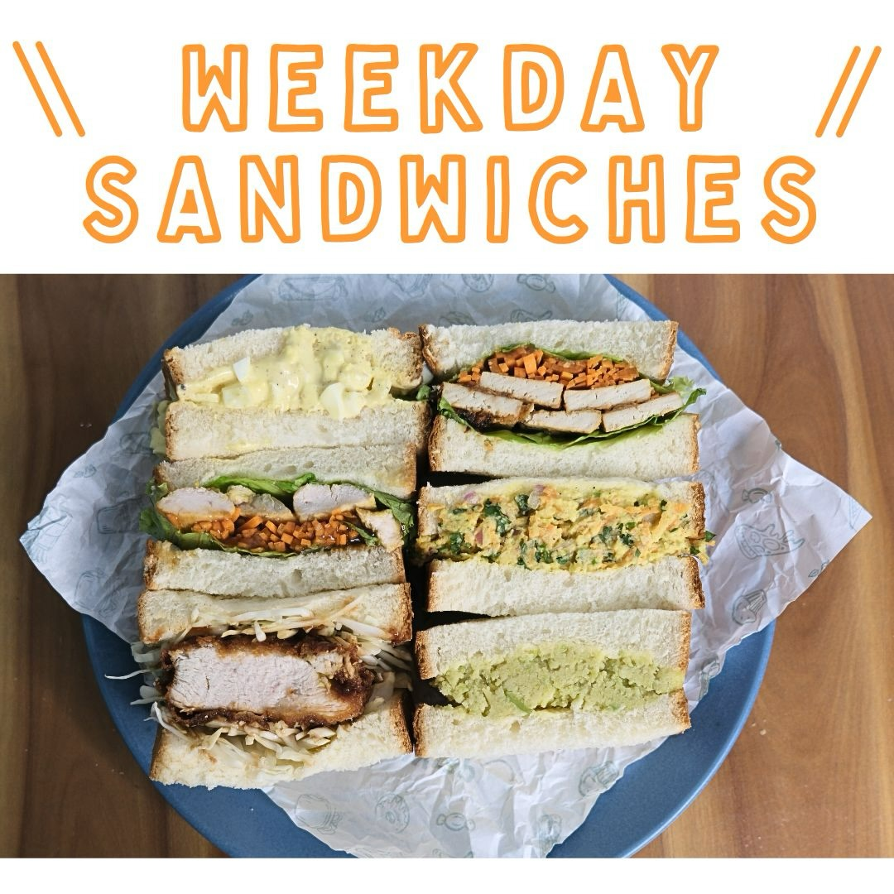

<p align="center">
  
</p>

<h1 align="center">Tome Cafe</h1>

<p align="center">
  <strong>Authentic Indo-Japanese Sandos — Handcrafted in Bangalore</strong>
</p>

<p align="center">
  <a href="https://tome.cafe">
    
  </a>
  
  
  
  
  
  
</p>

<p align="center">
  
</p>

---

## Table of Contents

- [Overview](#overview)
- [Features](#features)
- [Architecture](#architecture)
- [Tech Stack](#tech-stack)
- [Getting Started](#getting-started)
  - [Prerequisites](#prerequisites)
  - [Installation](#installation)
  - [Development](#development)
  - [Production Build](#production-build)
- [Configuration](#configuration)
  - [Environment Variables](#environment-variables)
  - [Theme & Colors](#theme--colors)
- [Agent & Developer Documentation](#agent--developer-documentation)
- [Project Structure](#project-structure)
- [Key Modules](#key-modules)
  - [Menu CMS (Google Sheets)](#menu-cms-google-sheets)
  - [Carousel Images CMS (Google Sheets)](#carousel-images-cms-google-sheets)
  - [Instagram Feed Automation](#instagram-feed-automation)
  - [Cart & Ordering](#cart--ordering)
  - [Internationalization (i18n)](#internationalization-i18n)
- [Testing](#testing)
- [CI/CD](#cicd)
- [Deployment](#deployment)
- [Analytics](#analytics)
- [Roadmap](#roadmap)
- [Contributing](#contributing)
- [License](#license)
- [Acknowledgements](#acknowledgements)

---

## Overview

**Tome Cafe** is a single-page application (SPA) powering the online presence for an Indo-Japanese sandwich (Sando) shop based in Bangalore, India. The site enables customers to browse the menu, build a cart, and place pre-orders directly via WhatsApp — no backend server required.

The menu is managed as a Google Sheet (acting as a headless CMS), and the Instagram feed is synced weekly via GitHub Actions — making the site fully static, fast, and maintainable by non-technical operators.

**Live Site:** [tome.cafe](https://tome.cafe) — hosted on **Cloudflare Pages**

---

## Features

| Category | Details |
|---|---|
| **Dynamic Menu** | Menu items sourced from a Google Sheet, synced weekly via GitHub Actions. Supports badges (`New`, `Bestseller`), list/sale pricing, and veg/non-veg categorization. |
| **WhatsApp Ordering** | Cart builds a pre-formatted WhatsApp message with item names, quantities, and total — no payment gateway needed. |
| **Trilingual Support** | Full UI translations for **English**, **Japanese** (日本語), and **Kannada** (ಕನ್ನಡ) with one-click language cycling. |
| **Instagram Feed** | Feed metadata fetched weekly via GitHub Actions from the Instagram Basic Display API. Token auto-refreshes on each run. Media downloaded at build-time (never committed to git). |
| **Responsive Design** | Mobile-first layout with sticky cart bar, slide-out cart sidebar, and smooth scroll navigation. |
| **SEO Optimized** | Schema markup, OpenGraph + Twitter Card meta tags, `robots.txt`, semantic HTML, and descriptive `<title>` tags. |
| **Analytics** | Google Analytics 4 (GA4) and Microsoft Clarity for behavioral analytics and session replays. |
| **Hero Carousel** | Rotating hero section with product photography — images managed via Google Sheet. |
| **Customer Reviews** | Review text carousel + gallery of customer feedback screenshots — images managed via Google Sheet. |
| **Policy Pages** | Dedicated routes for Privacy, Terms of Service, Refund, and Shipping policies. |
| **Cart Persistence** | Cart state persisted to `localStorage` — survives page reloads. |

---

## Architecture

```
┌───────────────────────────────────────────────────────────────┐
│              GitHub Actions — Weekly Sync and Deploy           │
│              (Every Monday 00:00 UTC / 05:30 IST)             │
│                                                               │
│  ┌──────────────────────┐   ┌──────────────────────────────┐  │
│  │  Instagram Update    │   │  Content Sync (Google Sheets)│  │
│  │  • Token health check│   │  • Fetch menu from Sheet     │  │
│  │  • Fetch IG metadata │   │  • Fetch carousel images     │  │
│  │  • Commit JSON       │   │  • Download Drive images     │  │
│  └──────────┬───────────┘   │  • Commit JSON + images      │  │
│             │               └──────────────┬───────────────┘  │
└─────────────┼──────────────────────────────┼──────────────────┘
              │                              │
              ▼                              ▼
    src/data/instagram.json       src/data/menu.json
                                  src/data/hero-banner.json
                                  src/data/testimonials.json
                                  public/menu/*.jpg
                                  public/hero-banner/*.jpg
                                  public/testimonials/*.jpg
              │                              │
┌─────────────┴──────────────────────────────┴──────────────────┐
│                       Vite Build Pipeline                      │
│   prebuild: download-instagram-images.cjs                      │
│   build:    vite build → dist/                                 │
└───────────────────────────────┬────────────────────────────────┘
                                │
                                ▼
┌───────────────────────────────────────────────────────────────┐
│                        React 19 SPA                           │
│                                                               │
│   Providers: LanguageProvider → CartProvider                  │
│                                                               │
│   ┌──────────┬────────────┬──────────┬───────────────────┐   │
│   │  Navbar  │    Hero    │   Menu   │  InstagramFeed    │   │
│   ├──────────┤  Carousel  │  (from   │  (from JSON)      │   │
│   │  Footer  │            │   JSON)  │                   │   │
│   ├──────────┤            ├──────────┤  ReviewCarousel   │   │
│   │  Sticky  │            │   Cart   │                   │   │
│   │  Cart    │            │ Sidebar  │  Policy Pages     │   │
│   └──────────┴────────────┴──────────┴───────────────────┘   │
│                                                               │
│   State:   CartContext (localStorage) + LanguageContext       │
│   Routing: react-router-dom (/, /privacy, /terms, etc.)       │
│   Styling: Tailwind CSS 4 + custom theme tokens               │
└───────────────────────────────┬───────────────────────────────┘
                                │
                                ▼
                    Deploy to Cloudflare Pages
                        (tome.cafe)
```

---

## Tech Stack

| Layer | Technology | Version |
|---|---|---|
| **Framework** | React | 19.x |
| **Build Tool** | Vite | 6.x |
| **Language** | TypeScript | 5.8 |
| **Styling** | Tailwind CSS | 4.x |
| **Routing** | React Router DOM | 7.x |
| **Icons** | Lucide React | 0.563+ |
| **Testing** | Vitest + React Testing Library | 4.x / 16.x |
| **Fonts** | Quicksand, Noto Sans JP, Noto Sans Kannada | Google Fonts |
| **CI/CD** | GitHub Actions | — |
| **Hosting** | Cloudflare Pages | — |
| **Analytics** | GA4 + Microsoft Clarity | — |

---

## Getting Started

### Prerequisites

- **Node.js** ≥ 18 (v20 recommended)
- **npm** ≥ 9

### Installation

```bash
# Clone the repository
git clone https://github.com/PalWorks/tome-cafe-website.git
cd tome-cafe-website

# Install dependencies
npm install
```

### Development

```bash
npm run dev
```

This will:
1. **Download Instagram media** (`predev` hook runs `download-instagram-images.cjs`)
2. **Start Vite dev server** on `http://localhost:3000`

> **Note:** Instagram images are fetched from CDN URLs stored in `src/data/instagram.json`. If this file is empty or the CDN URLs have expired, run `npm run fetch:instagram` first (requires `INSTAGRAM_TOKEN`).

### Production Build

```bash
# Build optimized static bundle
npm run build

# Preview the production build locally
npm run preview
```

The production-ready output is generated in the `dist/` directory.

---

## Configuration

### Environment Variables

| Variable | Required | Purpose | Used By |
|---|---|---|---|
| `INSTAGRAM_TOKEN` | For IG feed | Instagram Basic Display API long-lived user token | `fetch-instagram.cjs`, `check-instagram-token.cjs` |
| `SKUITEMMASTER_GOOGLE_SHEETS_API_KEY` | For menu + images sync | Google Sheets API key for reading menu data and carousel images | `fetch-menu.cjs`, `fetch-images.cjs` |
| `CLOUDFLARE_API_TOKEN` | For deployment | Cloudflare API token with Pages:Edit permission | GitHub Actions deploy step |
| `CLOUDFLARE_ACCOUNT_ID` | For deployment | Cloudflare account ID | GitHub Actions deploy step |

> These secrets are configured in **GitHub → Settings → Secrets and Variables → Actions**. For local development, export them in your shell before running the fetch scripts.

### Theme & Colors

Custom design tokens are defined in [`src/index.css`](src/index.css) using Tailwind CSS 4's `@theme` directive:

| Token | Hex | Usage |
|---|---|---|
| `--color-tome-bg` | `#fdfbf7` | Page background (warm off-white) |
| `--color-tome-primary` | `#e17b77` | Buttons, highlights, accents |
| `--color-tome-secondary` | `#8baa8b` | Secondary elements (muted green) |
| `--color-tome-dark` | `#2d2a26` | Body text |
| `--color-tome-accent` | `#f4a261` | Accent/CTA elements |

Fonts: `Quicksand` (English), `Noto Sans JP` (Japanese), `Noto Sans Kannada` (Kannada).

---

## Agent & Developer Documentation

To aid both human developers and LLM agents in understanding the codebase, we maintain a set of specialized markdown documents:

- **[ARCHITECTURE.md](ARCHITECTURE.md)**: High-level overview of the CI/CD data flow and component hierarchy.
- **[DOMAIN.md](DOMAIN.md)**: Business logic, language mapping, and WhatsApp ordering system.
- **[PLAYBOOK.md](PLAYBOOK.md)**: Standard procedures for adding menu items, testing locally, and running scripts.
- **[RUNBOOK.md](RUNBOOK.md)**: Troubleshooting guide for CI/CD failures, missing images, and Instagram tokens.
- **[MEMORY.md](MEMORY.md)**: Key architectural decisions, constraints, and trade-offs made during development.
- **[AGENTS.md](AGENTS.md)**: AI agent context documentation and rules.

---

## Project Structure

```
tome-cafe-website/
├── .github/
│   └── workflows/
│       └── weekly-sync-and-deploy.yml  # Weekly sync + Cloudflare Pages deploy
├── public/
│   ├── instagram/                      # Downloaded IG media (gitignored, build-time only)
│   ├── menu/                           # Downloaded menu images from Google Drive
│   ├── hero-banner/                    # Downloaded hero carousel images from Google Drive
│   ├── testimonials/                   # Downloaded testimonial images from Google Drive
│   ├── *.jpeg / *.png                  # Static product images, logos
│   └── robots.txt
├── scripts/
│   ├── check-instagram-token.cjs       # Token health check + auto-refresh
│   ├── download-instagram-images.cjs   # Build-time media downloader (predev/prebuild)
│   ├── fetch-instagram.cjs             # Fetches IG metadata → instagram.json
│   ├── fetch-menu.cjs                  # Fetches Google Sheet → menu.json + images
│   └── fetch-images.cjs               # Fetches Google Sheet → hero-banner.json, testimonials.json + images
├── src/
│   ├── components/                     # React UI components (10 components + tests)
│   │   ├── About.tsx                   # Founder story with animated timeline
│   │   ├── CartSidebar.tsx             # Slide-out cart with WhatsApp checkout
│   │   ├── CustomIcons.tsx             # SVG icon components
│   │   ├── Footer.tsx                  # Contact info, social links, policies
│   │   ├── Hero.tsx                    # Auto-rotating hero carousel
│   │   ├── InstagramFeed.tsx           # Instagram gallery (images + videos)
│   │   ├── Menu.tsx                    # Menu grid with veg/non-veg tabs
│   │   ├── Navbar.tsx                  # Responsive navbar with language toggle
│   │   ├── PolicyPages.tsx             # Privacy, Terms, Refund, Shipping
│   │   ├── ReviewCarousel.tsx          # Customer review carousel + gallery
│   │   └── StickyCart.tsx              # Mobile floating cart bar
│   ├── context/
│   │   └── CartContext.tsx             # Cart state with localStorage persistence
│   ├── data/
│   │   ├── instagram.json              # Instagram feed metadata (auto-generated weekly)
│   │   ├── menu.json                   # Menu items (auto-generated from Google Sheet)
│   │   ├── hero-banner.json            # Hero carousel images (auto-generated from Google Sheet)
│   │   └── testimonials.json          # Testimonial images (auto-generated from Google Sheet)
│   ├── locales/
│   │   ├── en.ts                       # English translations
│   │   ├── jp.ts                       # Japanese translations
│   │   └── kn.ts                       # Kannada translations
│   ├── test/
│   │   ├── setup.ts                    # Vitest setup (jest-dom matchers)
│   │   └── constants.test.ts           # Tests for constants & data integrity
│   ├── utils/
│   │   └── translation.ts              # Translation utility helpers
│   ├── App.tsx                         # Root component with routing
│   ├── constants.ts                    # App-wide constants, data imports
│   ├── index.css                       # Tailwind theme + design tokens
│   ├── index.tsx                       # React DOM entry point
│   ├── LanguageContext.tsx             # Language state + toggle (en → jp → kn)
│   ├── translations.ts                 # Translation barrel export
│   └── types.ts                        # TypeScript interfaces
├── index.html                          # HTML entry with SEO meta tags, fonts, analytics
├── AGENTS.md                           # AI agent context documentation
├── package.json
├── postcss.config.js
├── tsconfig.json
└── vite.config.ts
```

---

## Key Modules

### Menu CMS (Google Sheets)

The menu is managed in a [**Google Sheet**](https://docs.google.com/spreadsheets/d/18Yadl4c243IPOgAOCXCJ-o61t2EITww7Uxg7roHxMpY) acting as a lightweight headless CMS. This allows non-technical team members to update menu items, prices, badges, and images without touching code.

**How it works:**

1. Menu data lives in a Google Sheet (columns: Name, Description, List Price, Selling Price, Category, Ingredients, Badge, Image).
2. The `fetch-menu.cjs` script reads the sheet via the Google Sheets API.
3. If an item has a **Google Drive image URL**, the script downloads the image to `public/menu/`.
4. Processed data is written to `src/data/menu.json`.
5. The GitHub Actions workflow (`weekly-sync-and-deploy.yml`) runs this every **Monday** and auto-commits changes.

**Manual update:**
```bash
export SKUITEMMASTER_GOOGLE_SHEETS_API_KEY='your_api_key'
npm run fetch:menu
```

### Carousel Images CMS (Google Sheets)

Hero banner and testimonial carousel images are managed in the **same Google Sheet** as the menu, using dedicated tabs:

| Tab | Columns | Output |
|---|---|---|
| `HeroBanner` | Sorting Order, Image (Drive URL), Alt Text | `src/data/hero-banner.json` + `public/hero-banner/` |
| `Testimonials` | Sorting Order, Image (Drive URL), Alt Text, Border Color | `src/data/testimonials.json` + `public/testimonials/` |

**Image specifications:**
- **Dimensions:** 1080×1080 px (1:1 square)
- **Format:** JPEG
- **Max size:** 300 KB (hero), 200 KB (testimonials)

**How it works:**
1. Update images in the Google Sheet tabs (paste Google Drive sharing URLs).
2. The `fetch-images.cjs` script reads both tabs via the Google Sheets API.
3. For each Drive URL, the script downloads the image to `public/hero-banner/` or `public/testimonials/`.
4. Processed data is written to `src/data/hero-banner.json` and `src/data/testimonials.json`.
5. The weekly GitHub Actions workflow auto-commits changes.

**Manual update:**
```bash
export SKUITEMMASTER_GOOGLE_SHEETS_API_KEY='your_api_key'
npm run fetch:images
```

### Instagram Feed Automation

The Instagram integration uses a **"git scraping"** pattern — metadata is fetched via the Instagram Basic Display API and committed to the repo, while actual media files are downloaded at build-time.

**Pipeline:**

| Step | Script | Timing |
|---|---|---|
| 1. Token health check + auto-refresh | `check-instagram-token.cjs` | Weekly (Monday, GitHub Actions) |
| 2. Fetch post metadata (14 latest posts) | `fetch-instagram.cjs` | Weekly (Monday, GitHub Actions) |
| 3. Commit `instagram.json` | GitHub Actions | Weekly (Monday) |
| 4. Download media to `public/instagram/` | `download-instagram-images.cjs` | Build-time (`prebuild`/`predev`) |

**Key design decisions:**
- Media files are **never committed** to git (`.gitignore` excludes `public/instagram/`).
- The download script is **idempotent** — it skips files that already exist.
- Downloads run with **5-way concurrency** and a 30-second timeout per file.
- The token health check **auto-refreshes** the token on every run, keeping it alive indefinitely. If the token is revoked, the workflow fails and GitHub notifies repo admins by email.

**Manual update:**
```bash
export INSTAGRAM_TOKEN='your_long_lived_token'
npm run fetch:instagram
```

### Cart & Ordering

The cart system uses React Context (`CartContext`) with full `localStorage` persistence.

**Flow:**
1. User browses menu → clicks "Add to Cart" on items.
2. Cart sidebar slides in showing items, quantities, and total.
3. "Order via WhatsApp" generates a pre-formatted message with line items.
4. Clicking the button opens WhatsApp to the cafe's number with the order message pre-filled.

**Cart API (`useCart` hook):**
- `addToCart(item)` — Add or increment item
- `removeFromCart(itemId)` — Remove item entirely
- `updateQuantity(itemId, delta)` — Increment/decrement (auto-removes at 0)
- `clearCart()` — Empty the cart
- `toggleCart()` — Show/hide sidebar
- `cartTotal` / `cartCount` — Computed values

### Internationalization (i18n)

The app supports three languages with a one-click toggle in the navbar:

| Language | Font | Locale File |
|---|---|---|
| English | Quicksand | `src/locales/en.ts` |
| Japanese (日本語) | Noto Sans JP | `src/locales/jp.ts` |
| Kannada (ಕನ್ನಡ) | Noto Sans Kannada | `src/locales/kn.ts` |

Usage in components:
```tsx
const { t, language, toggleLanguage } = useLanguage();
// t.hero_title, t.menu_heading, t.about_text, etc.
```

---

## Testing

The project uses **Vitest** with **React Testing Library** and **jsdom** as the test environment.

```bash
# Run all tests
npm test

# Run tests in watch mode
npx vitest --watch
```

**Test coverage:**

| Component/Module | Test File |
|---|---|
| `About` | `About.test.tsx` |
| `CartSidebar` | `CartSidebar.test.tsx` |
| `Footer` | `Footer.test.tsx` |
| `Hero` | `Hero.test.tsx` |
| `InstagramFeed` | `InstagramFeed.test.tsx` |
| `Menu` | `Menu.test.tsx` |
| `Navbar` | `Navbar.test.tsx` |
| `PolicyPages` | `PolicyPages.test.tsx` |
| `ReviewCarousel` | `ReviewCarousel.test.tsx` |
| `StickyCart` | `StickyCart.test.tsx` |
| `CartContext` | `CartContext.test.tsx` |
| `LanguageContext` | `LanguageContext.test.tsx` |
| Constants & Data | `constants.test.ts` |

---

## CI/CD

There is a single GitHub Actions workflow that handles all automation — content syncing, Instagram updates, and deployment.

### Weekly Sync and Deploy (`weekly-sync-and-deploy.yml`)

- **Schedule:** Every **Monday at 00:00 UTC** (05:30 IST)
- **Trigger:** `schedule` + `workflow_dispatch` (manual run from GitHub Actions UI)
- **Steps:**
  1. Check Instagram token health + auto-refresh
  2. Fetch latest 14 Instagram posts → commit `src/data/instagram.json`
  3. Fetch menu data from Google Sheet → commit `src/data/menu.json` + images
  4. Fetch carousel images from Google Sheet → commit JSONs + images
  5. `npm ci && npm run build` (the `prebuild` hook downloads Instagram media)
  6. Deploy `dist/` to Cloudflare Pages via `cloudflare/pages-action@v1`

> **Important:** There is **no push-triggered deployment**. Code changes pushed to `main` will only go live when the next Monday workflow runs (or when manually triggered via `workflow_dispatch`). To deploy immediately after a code change, trigger the workflow manually from the GitHub Actions tab.

### Required GitHub Secrets

All four secrets must be set under **GitHub → Settings → Secrets and Variables → Actions**:

| Secret | Purpose |
|---|---|
| `INSTAGRAM_TOKEN` | Instagram Basic Display API long-lived token |
| `SKUITEMMASTER_GOOGLE_SHEETS_API_KEY` | Google Sheets API key for menu + images |
| `CLOUDFLARE_API_TOKEN` | Cloudflare API token (Pages:Edit permission) |
| `CLOUDFLARE_ACCOUNT_ID` | Cloudflare account ID |

Each data-fetch step gracefully skips itself (with a log message) if its secret is missing, so a missing secret will not fail the whole workflow — but that step's data will not be updated.

---

## Deployment

This is a **static site** — no server runtime required. The production host is **Cloudflare Pages** at [tome.cafe](https://tome.cafe) (project name: `tomecafe-website`).

```bash
npm run build
# → dist/ contains the complete deployable static bundle
```

Deployment is automated via the weekly GitHub Actions workflow. For a manual deploy outside the schedule:

1. Go to **GitHub → Actions → Weekly Sync and Deploy**
2. Click **Run workflow** → **Run workflow**

This will sync all content and push the latest build to Cloudflare Pages.

> **Note:** The `prebuild` hook automatically downloads Instagram media before building. Ensure `src/data/instagram.json` has valid CDN URLs, or run `npm run fetch:instagram` before building locally.

---

## Analytics

The site integrates two analytics platforms (configured in `index.html`):

- **Google Analytics 4** — Tracking ID: `G-S81JN319T3`
- **Microsoft Clarity** — Project ID: `va2yognidz`

Both load asynchronously and do not impact page load performance.

---

## Roadmap

- [ ] **Push-triggered deployment** — Add `on: push` trigger to deploy immediately on code changes without waiting for the Monday schedule
- [ ] **Online payments** — Integrate UPI/Razorpay for direct in-app checkout
- [ ] **Order tracking** — Real-time order status updates
- [ ] **Admin dashboard** — Manage orders, menu, and availability
- [ ] **PWA support** — Installable app with offline menu browsing
- [ ] **Automated testing in CI** — Add `npm test` step to the GitHub Actions workflow
- [ ] **Image optimization** — WebP/AVIF conversion for product images
- [ ] **Menu scheduling** — Time-based menu availability (weekday vs. weekend specials)

---

## Contributing

1. **Fork** the repository
2. Create a feature branch: `git checkout -b feat/your-feature`
3. Make your changes and ensure tests pass: `npm test`
4. Commit with a descriptive message: `git commit -m "feat: add your feature"`
5. Push to your fork: `git push origin feat/your-feature`
6. Open a **Pull Request** against `main`

**Conventions:**
- Commit messages follow [Conventional Commits](https://www.conventionalcommits.org/)
- Styling uses Tailwind CSS utility classes with custom `tome-*` tokens
- Icons from `lucide-react` — avoid inline SVGs
- All components should have corresponding test files

---

## License

This project is licensed under the [MIT License](LICENSE).

---

## Acknowledgements

- Shokupan inspiration from Japan's iconic milk bread sandwiches
- [Lucide Icons](https://lucide.dev/) for the beautiful icon set
- [Tailwind CSS](https://tailwindcss.com/) for the utility-first styling framework
- [Vite](https://vitejs.dev/) for the blazing-fast development experience
- [Google Fonts](https://fonts.google.com/) for Quicksand, Noto Sans JP, and Noto Sans Kannada

---

<p align="center">
  Made with love for <strong>Tome Cafe</strong> — <em>Konnichiwa from Bangalore</em>
</p>
