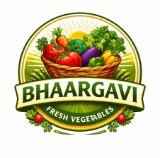

<p align="center">
  
</p>

<h1 align="center">Bhaargavi Fresh Cuts</h1>

<p align="center">
  <strong>FSSAI-certified, RO-washed, ready-to-cook cut vegetables &amp; fruits — delivered across Chennai.</strong>
</p>

<p align="center">
  
  
  
  
</p>

---

## What this is

A static, mobile-first single-page marketing + ordering site for **Bhaargavi Fresh Cuts**, a
Chennai business selling pre-cut, RO-washed, ready-to-cook vegetables, fruits, and health packs.

There is **no application server and no payment gateway**. Customers build a cart and check out
over **WhatsApp**; orders are also logged best-effort to a Google Apps Script webhook. The product
catalog is managed in a **Google Sheet** and baked into the site at build time.

See [`ARCHITECTURE.md`](ARCHITECTURE.md), [`DOMAIN.md`](DOMAIN.md), and [`AGENTS.md`](AGENTS.md)
for the system design, business rules, and contributor guardrails.

## Tech stack

| Area | Choice |
|---|---|
| UI | React 19, React Router 7 |
| Build | Vite 6, TypeScript 5 |
| Styling | Tailwind CSS 4, `bv-*` design tokens in `src/index.css` |
| Icons | `lucide-react` |
| State | React Context (`CartContext`, `LanguageContext`) + `localStorage` |
| Data | Google Sheets → build scripts → `src/data/*.json` |
| Checkout | WhatsApp deep link (`wa.me`) |
| Order log | Google Apps Script Web App (`doPost`) |
| Hosting | Cloudflare Pages (static) |
| i18n | English / Tamil / Hindi (`src/locales/`) |

## Quick start

```bash
npm install
cp .env.example .env   # fill in what you have; everything is optional for local dev
npm run dev            # http://localhost:3000
```

The catalog is fully sheet-driven: products come from `src/data/menu.json` (synced from the Google
Sheet `ProductCatalog` tab). If that file is empty, the product grid simply shows its empty state —
there is no hardcoded product fallback.

### Scripts

| Command | What it does |
|---|---|
| `npm run dev` | Vite dev server |
| `npm run build` | Type-check, Vite build, **pre-render every route**, and generate `sitemap.xml` (WebP images built in prebuild) |
| `npm run preview` | Serve the production build locally |
| `npm test` | Run the Vitest unit suite |
| `npm run lint` | ESLint |
| `npm run fetch:all` | Pull catalog, config, images & Instagram from the Sheet/API (needs keys) |
| `npm run extract:hero` | Regenerate the hero frames + loop video from `media-src/hero/` (needs ffmpeg) |

## How data flows

```
Google Sheet ──fetch-config.cjs──▶ src/data/config.json ──▶ SITE_CONFIG
(Config tab)                                                 (min order, waNumber, delivery info)

Google Sheet ──fetch-menu.cjs────▶ src/data/menu.json  ──▶ MENU_ITEMS
(ProductCatalog tab)   └─translate-menu.cjs─▶ i18n (ta/hi) + categories-i18n.json
```

- **Source of truth for products & config is the Google Sheet**, not the React code. Don't hardcode
  new products; add rows to the `ProductCatalog` tab. `fetch-menu.cjs` then auto-translates
  name/description/ingredients and category labels into Tamil/Hindi (cached in `i18n-cache.json`).
- The **weekly GitHub Action** (`.github/workflows/weekly-sync-and-deploy.yml`) re-fetches the Sheet,
  commits changes, builds, and deploys. All fetch steps are skipped gracefully if secrets are absent.

## Checkout & order logging

1. Cart lives in `CartContext` (mirrored to `localStorage`).
2. On checkout the client builds a formatted message and best-effort `POST`s the order to
   `VITE_APPS_SCRIPT_URL` (2s timeout, `no-cors`, non-blocking).
3. The user is then sent to `https://wa.me/<number>?text=<message>`.

The WhatsApp number is `SITE_CONFIG.waNumber` (from the Sheet), exposed as `WA_NUMBER` in
`constants.ts`, with the hardcoded `CONTACT_PHONE` as a fallback. The order message uses real
newlines and is `encodeURIComponent`-ed at send time, and the cart/order always uses the English
product name so the server-side price recompute in `apps-script/Code.gs` matches the catalog.

## Multi-language (EN / TA / HI)

- **UI strings** live in `src/locales/{en,ta,hi}.ts`, read via `useLanguage().t`. Never hardcode
  display text. `src/locales/locales.test.ts` fails CI if the locales drift out of sync.
- **Product content** (name/description/ingredients) and **category tab labels** are
  machine-translated at build time by `scripts/translate-menu.cjs` (chained into
  `npm run fetch:menu`), cached in `src/data/i18n-cache.json`, and written into `menu.json`'s
  `i18n` field + `src/data/categories-i18n.json`. New products translate automatically on the next
  publish. English is always the fallback. Set `GOOGLE_TRANSLATE_API_KEY` to use the official Cloud
  Translation API instead of the default public endpoint.
- Language choice persists in `localStorage` and is reflected on `<html lang>`.

## Analytics

Google Analytics 4 (`G-0G41ZVRP04`) and Microsoft Clarity (`xhu2xeyyc0`) load from `index.html`.
Their origins are whitelisted in the CSP `meta` tag; adding any new external origin requires
updating that CSP or the browser will block it.

## Publishing catalog changes

Edit the `ProductCatalog` tab, then either use the spreadsheet's **Bhaargavi → Publish catalog to
website** button, run `gh workflow run publish.yml`, or `npm run fetch:menu` locally and redeploy.
See [`apps-script/README.md`](apps-script/README.md) for the button + token setup.

## The hero background

Progressive enhancement in `src/components/ScrollVideoBackground.tsx`:

- **Canvas image-sequence (primary, wide screens):** a 96-frame JPEG sequence in
  `public/hero-frames/` is drawn to a `<canvas>` by scroll position. No video seeking → smooth and
  reliable. Frame count/size live in `public/hero-frames/manifest.json`.
- **Autoplay loop (fallback, phones/low-power):** `public/hero-video.mp4` (muted, looping, faststart)
  with a clamped GPU parallax.
- **Poster (reduced-motion / save-data / slow links):** static `public/hero-poster.jpg`.

To change the hero clip: drop new masters in `media-src/hero/`, update `inputs.txt`, then run
`npm run extract:hero` and commit the regenerated `public/hero-frames/` + `public/hero-video.mp4`.

## Environment variables

See [`.env.example`](.env.example). All are optional for local dev; production values are set as
GitHub Actions secrets. Key ones:

| Var | Purpose |
|---|---|
| `VITE_APPS_SCRIPT_URL` | Apps Script Web App URL for order logging |
| `VITE_GOOGLE_PLACE_ID` | Enables Google review buttons (graceful WhatsApp CTA while blank) |
| `SKUITEMMASTER_GOOGLE_SHEETS_API_KEY` / `BHAARGAVI_SHEETS_ID` | Catalog/config fetch |
| `INSTAGRAM_TOKEN` | Instagram feed fetch |
| `CLOUDFLARE_API_TOKEN` / `CLOUDFLARE_ACCOUNT_ID` | Deploy |

## Deployment

Static build to `dist/`, hosted on Cloudflare Pages. Every route is **pre-rendered to its own HTML
file** at build time (see [SEO & pre-rendering](#seo--pre-rendering)), so deep links resolve directly
and crawlers get real HTML. There is **no SPA catch-all redirect** — unmatched paths serve
`public/404.html` with a real 404, and Cloudflare 308-normalizes non-slash → trailing-slash URLs.

Deploys are **manual/scheduled by design** — there is no `push:` trigger, so pushing to `main`
does not go live on its own. Production updates only via the Monday cron, `gh workflow run
publish.yml`, or the spreadsheet's Publish button. See [`ARCHITECTURE.md`](ARCHITECTURE.md#deploy-pipeline).

## SEO & pre-rendering

The app is a client-side SPA, so the build renders crawlable HTML for every route:

- **Pre-render (`scripts/prerender.cjs`):** after `vite build`, headless Chromium visits each route
  and writes `dist/<route>/index.html` with real content. It blocks third-party requests and waits on
  `#root` content (not `networkidle0`), keeping the build ~20s.
- **Route list is auto-derived** from the catalog by `scripts/site-routes.cjs`: static pages +
  `/category/<slug>/` (one per category) + `/products/<slug>/` (one per product). `prerender.cjs` and
  `scripts/generate-sitemap.cjs` both consume it, so **the sitemap and prerender never drift**. A new
  page still needs its route in `src/App.tsx` (and, if static, in `site-routes.cjs`).
- **Per-route `<head>`:** `src/components/Seo.tsx` sets title/description/canonical/OG per route;
  `src/components/JsonLd.tsx` emits structured data (`Product`, `CollectionPage`/`ItemList`,
  `FAQPage`, `BreadcrumbList`; `LocalBusiness`/`GroceryStore` in `index.html`).
- **Images:** `scripts/optimize-images.cjs` (prebuild) generates WebP variants of `public/menu/*.png`;
  cards/product pages use `<picture>` with a PNG fallback and explicit dimensions (CLS).
- **IndexNow:** `publish.yml` pings IndexNow with the sitemap URLs after each deploy (public key file
  in `public/`) so Bing recrawls.
- **Core Web Vitals monitoring:** `apps-script/CoreWebVitals.gs` logs weekly PSI results to a
  `CoreWebVitals` tab in the Sheet (see [`apps-script/README.md`](apps-script/README.md)).

## Placeholders to replace before launch

These are intentionally set to easy-to-find placeholders until the real accounts exist:

| Placeholder | Where | Replace with |
|---|---|---|
| Instagram `@bhaargavifreshvegetables` | `src/constants.ts` (`INSTAGRAM_URL`, `INSTAGRAM_HANDLE`) | the live handle |
| Google reviews | `VITE_GOOGLE_PLACE_ID` (unset) | the Business Profile Place ID |

Social preview (`public/og-image.jpg`, 1200x630) and favicons (`public/favicon-32.png`,
`public/apple-touch-icon.png`) are generated from the logo; replace with custom art if desired.
